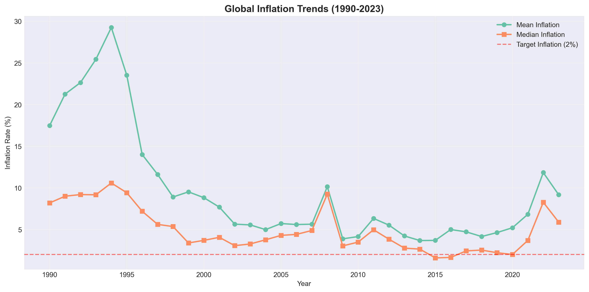
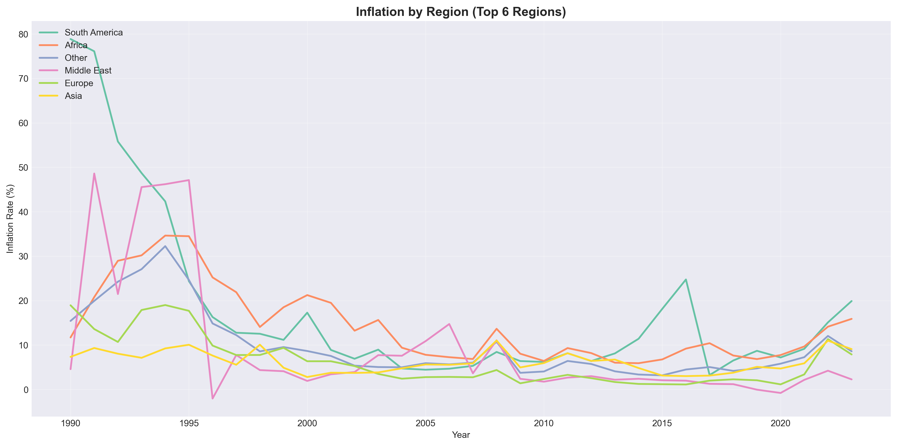
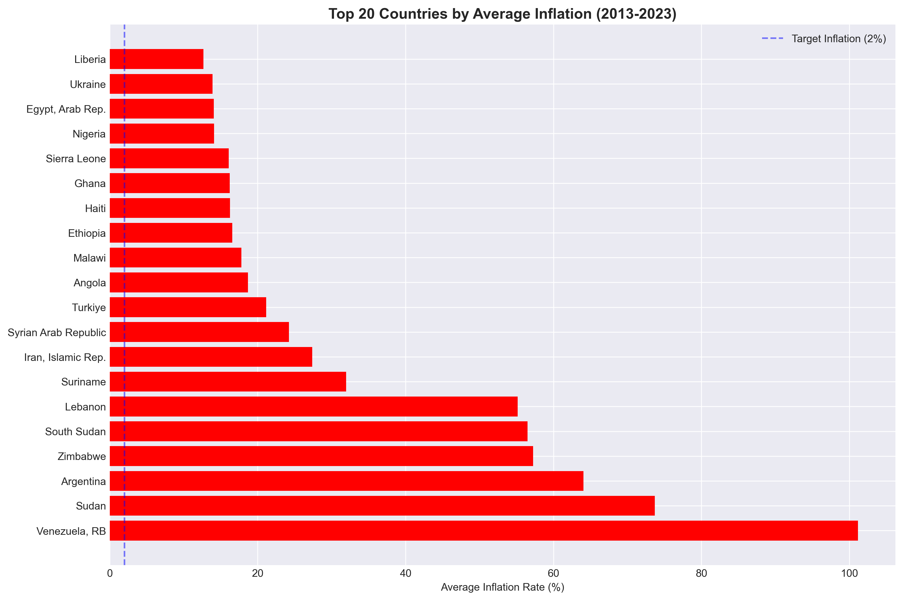
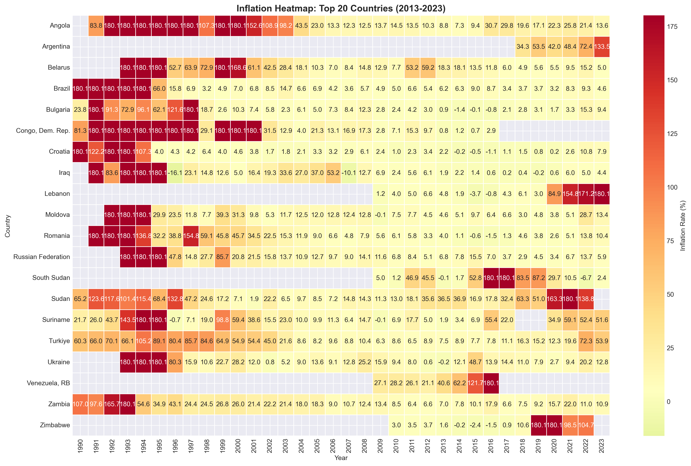
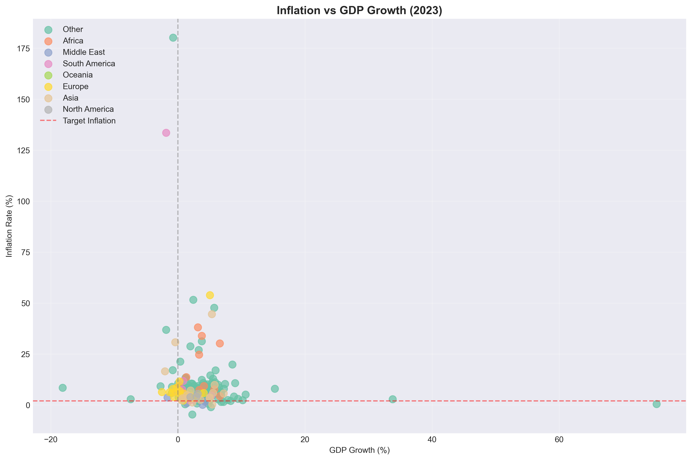
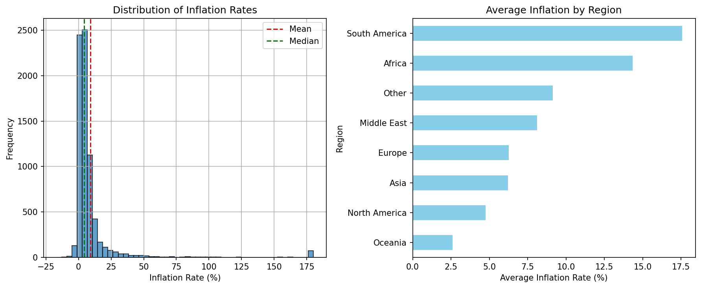

# 🌍 Global Inflation Analysis

## 📌 Project Overview
This project builds a complete **data pipeline** to collect, clean, explore, and statistically analyze global inflation data from the World Bank. Using four indicators (inflation, GDP growth, GDP per capita, unemployment) spanning 1990–2023 for countries worldwide, I uncover regional patterns, temporal shifts, and relationships with economic growth and income levels.

## 🎯 Research Questions
- Are there significant differences in inflation rates across regions?
- Is there a correlation between inflation and GDP growth?
- Has global inflation changed significantly over time?
- Does inflation vary by country income level?

## 🔧 Tools & Technologies
- **Python**: Pandas, NumPy, Matplotlib, Seaborn, Plotly
- **Statistics**: ANOVA, pairwise t‑tests (Bonferroni), Pearson & Spearman correlations, two‑sample t‑tests
- **Data Source**: World Bank API (CSV downloads)
- **Visualization**: Static and interactive (Plotly) charts

## 📊 Key Insights
| Metric | Finding |
|--------|---------|
| **Regional Differences** | South America (17.6%) and Africa (14.3%) have the highest inflation; Oceania (2.6%) and North America (4.8%) the lowest. ANOVA confirms differences are highly significant (p < 0.001). |
| **Inflation–GDP Relationship** | Weak negative linear correlation (r = –0.17, p < 0.001) – higher inflation slightly associated with lower growth, but the effect is not strong. |
| **Temporal Change** | Global inflation dropped from 18.2% in the 1990s to 4.6% in the 2010s, then rose to 8.3% in the 2020s. Pre‑2008 vs post‑2010 difference is highly significant (p < 0.001). |
| **Income Level Impact** | High‑income countries average 3.15% inflation; lower‑middle, upper‑middle, and low‑income groups all average ~12–14%. ANOVA is significant (p < 0.001). |

## 🖥️ Visualizations
  
*Mean and median global inflation (1990–2023) with 2% target line.*

  
*Inflation trends for the top 6 regions.*

  
*Top 20 countries by average inflation (2013–2023).*

  
*Heatmap for the top 20 countries (2013–2023).*

  
*Scatter plot of inflation vs GDP growth in 2023, coloured by region.*

  
*Histogram of inflation rates (capped at 99th percentile).*

## 🚀 How to Reproduce
1. Clone this repository.
2. Install dependencies: `pip install pandas numpy matplotlib seaborn plotly scipy statsmodels wbgapi`
3. **Download the World Bank CSV files** or download them from the repo. Place the four CSV files in the main repository folder.
4. Run the notebooks in order:
   - `01_data_collection.ipynb` → creates `inflation_clean.csv`
   - `02_data_cleaning.ipynb` → creates `inflation_cleaned.csv` and `country_summary.csv`
   - `03_exploratory_analysis.ipynb` → creates all visualizations
   - `04_statistical_analysis.ipynb` → prints statistical results to the console

All outputs are saved in the same folder (no subdirectories).

## 📁 Repository Structure
```
global-inflation-analysis/
│
├── 01_data_collection.ipynb
├── 02_data_cleaning.ipynb
├── 03_exploratory_analysis.ipynb
├── 04_statistical_analysis.ipynb
│
├── inflation_clean.csv              (optional, may be deleted after cleaning)
├── inflation_cleaned.csv
├── country_summary.csv
│
├── global_inflation_trend.png
├── regional_inflation.png
├── top_inflation_countries.png
├── inflation_heatmap.png
├── inflation_vs_gdp.png
├── inflation_distribution.png
│
└── README.md
```

## 💡 Economic Interpretation
- **Regional targeting**: South America and Africa should be monitored closely for monetary policy; their high and volatile inflation may indicate structural challenges.
- **Weak inflation–growth trade‑off**: The lack of a strong negative correlation suggests that other factors (e.g., exchange rates, supply shocks) dominate the inflation–growth nexus in the global sample.
- **Income‑level gradient**: High‑income countries maintain low inflation, while developing economies face more pressure. This may reflect better institutions, central bank credibility, and fiscal discipline.
- **Temporal shifts**: The post‑2010 decline reflects a long‑term disinflation trend, but the recent uptick (2020s) suggests renewed inflationary pressures, likely driven by pandemic‑era stimulus and supply chain disruptions.
